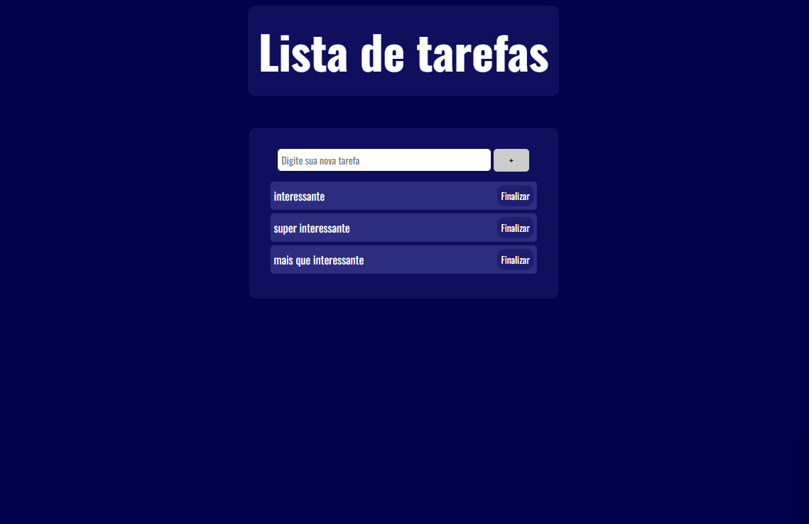

# Lista de Tarefas (To Do List)



## 🗺️ Sobre o projeto

Projeto criado com o intuito de colocar em prática as coisas que estou aprendendo sobre JavaScript, e nada melhor que começar fazendo uma To Do List. Assim como a imagem acima, foi implementado a lógica do botão para ele ficar cinzento quando o usuário escreve algo com menos de 3 caracteres, essa lógica está apenas no botão de adicionar a tarefa (logicamente)! Toda tarefa terá um botão "finalizar", que assim que for clicado, sumirá da lista, pois, já foi concluido a tarefa.

## 🔨 Tecnologias

- HTML
- CSS
- JavaScript

## 🚀 Como rodar este projeto

Lembrando que para rodar este projeto é necessário ter instalado o Git

### ✅ Clonando o repositório

```bash
# Clonando o repositório
$ git clone https://github.com/JoaoAlves20/to-do-list.git
# Entrando na pasta criada
$ cd to-do-list
```

Lembrando que para fazer funcionar, basta abrir o arquivo "index.html" no Navegador, tanto de forma tradicional quanto usando a extensão do Visual Studio Code, que é chamado de Live Server.